# Build kernel below 5.4 tutorial with RainyXeon's github workflow

If you have a device that have kernel below 5.4, then this tutorial is for you! During this tutorial, I will use `<some_contents>` for your choices, so please remove `<>` before process. This tutorial will be hard for user doesn't familiar with programing so if you're the normal people you can try to build it without any configuarion for learning or ask someone who have a basic knowledge about this.

## Table of Contents

- [Build kernel below 5.4 tutorial with RainyXeon's github workflow](#build-kernel-below-54-tutorial-with-rainyxeons-github-workflow)
  - [Table of Contents](#table-of-contents)
  - [⚠ Disclaimer](#-disclaimer)
  - [Notes References](#notes-references)
  - [1. Clone your kernel source](#1-clone-your-kernel-source)
  - [2. Create codespaces and setup some args (Check NOTE\_1 and NODE\_2 before process)](#2-create-codespaces-and-setup-some-args-check-note_1-and-node_2-before-process)
  - [3. Apply patches for KSU and susfs (Check NOTE\_1 and NODE\_2 before process)](#3-apply-patches-for-ksu-and-susfs-check-note_1-and-node_2-before-process)
  - [3.1. Fix the patches](#31-fix-the-patches)
  - [3.2. Copy susfs files from susfs4ksu source (Only do if you use susfs)](#32-copy-susfs-files-from-susfs4ksu-source-only-do-if-you-use-susfs)
  - [3.3. Push the changes into your repo](#33-push-the-changes-into-your-repo)
  - [4. Prepare and Build workflow](#4-prepare-and-build-workflow)

## ⚠ Disclaimer

> **Warning:**  
> Building and flashing a custom Android kernel involves potential risks. Proceed only if you understand the consequences and accept full responsibility.

- This build kernel tutorial is provided **as-is** with **no warranties or guarantees** of stability, compatibility, or safety.
- Flashing custom kernels may **void your warranty** and **brick your device** if done incorrectly.
- The maintainer(s) of this project are **not responsible** for:
  - Data loss  
  - Bootloops  
  - Hardware damage  
  - Violations of warranty or service terms
- Most of kernel won't be boooted in the stock rom so be careful

By using, modifying, or flashing this kernel, you agree that **you do so at your own risk**.

If you do not understand what you're doing, please **do not proceed**.

---

*Happy building and stay safe!*

## Notes References

- NOTE_1: If you don't need ksu, susfs or CONFIG something, skip this step!
- NOTE_2: If you already have ksu + susfs in your source and configured, skip this step. You can check that by trying to open `fs/open.c` to check `CONFIG_KSU` and `fs/susfs.c` to check if already have susfs. After that check `arch/arm64/configs/<device_codename>_defconfig` see if already have configured bye search `CONFIG_KSU_`.

## 1. Clone your kernel source

Before do this step, please make sure that you have an account in github. If you don't have it before, go to <https://github.com/signup> to create an account.

Kernel source can be some where in the Github platform. So go to the Github search bar and type `kernel <device_manufacture> <device_codename>`.

If you not sure about device codename, download `DevCheck` app here <https://devcheck.app/> and go to `system` tab, you will see the device codename in `Device` field on `Device` card

In this tutorial, we will use `Redmi Note 12 pro 5G (ruby)` as a device for example. After searching, we see that some results. Those are kernel sources from users customized, feel free to clone that!


We will choose `fjrXTR/kernel_xiaomi_ruby` for this tutorial. CLick on that one and you will see this UI

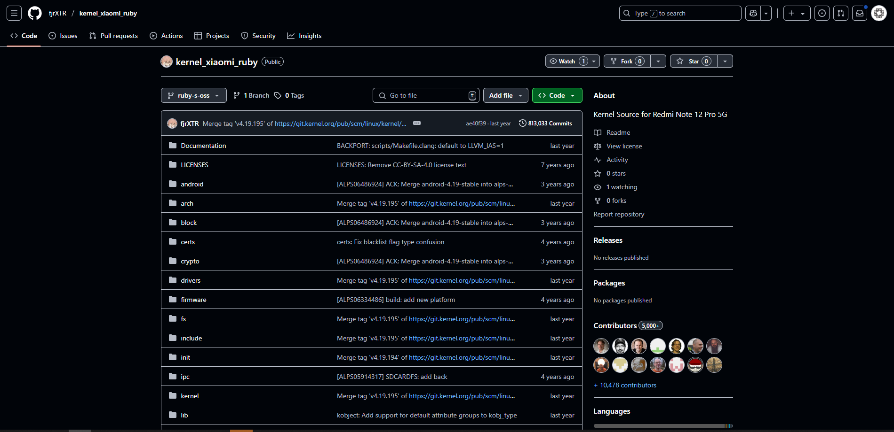

Click on the `Fork` button

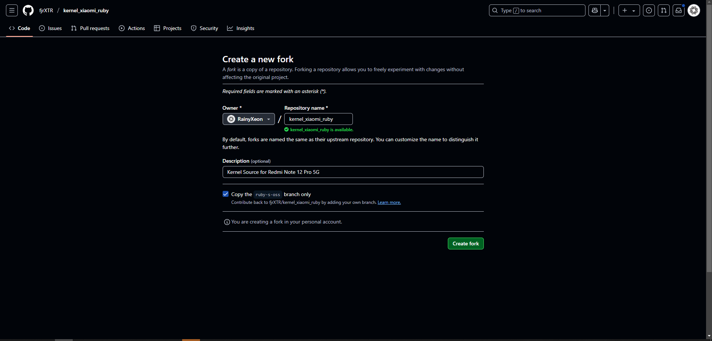

Uncheck the `Cope the <something> branch only` and click `Create Fork`. It will redirect you to the cloned repo, wait for a while and you finished clone kernel source step!

## 2. Create codespaces and setup some args (Check NOTE_1 and NODE_2 before process)

To create codespace, click on `Code` button, click on `Codespace` tab and click `Create codespace on <branch>` like this:

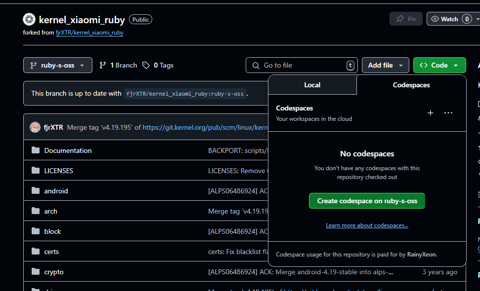

Wait for it to setup and you will see this UI!

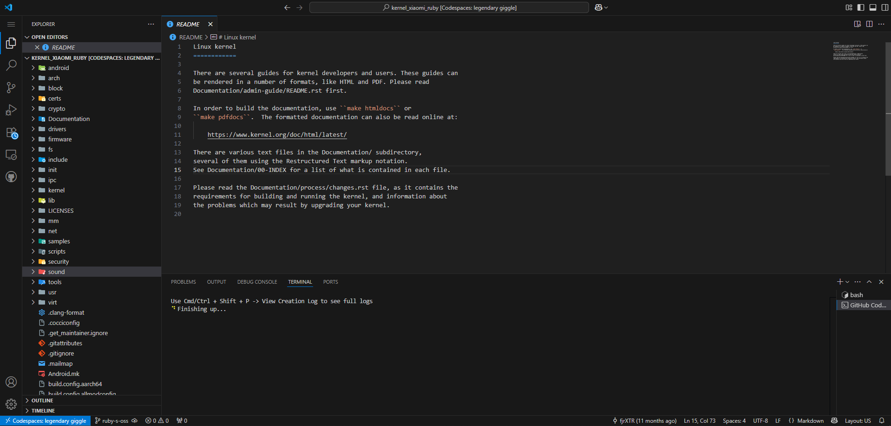

Go to `arch/arm64/configs/<device_codename>_defconfig` to see the config of your specific device!

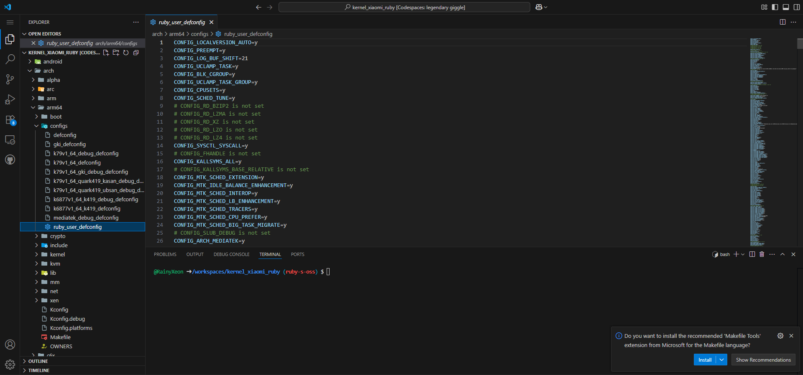

If you know what you're doing, you can do your config here (disable / enable it). If you don't, just ignore it and follow me next step.

Now if you need susfs + ksu, paste this config below your file

```env
CONFIG_KSU=y 
CONFIG_KSU_LSM_SECURITY_HOOKS=y
CONFIG_KSU_SUSFS=y
CONFIG_KSU_SUSFS_SUS_PATH=y
CONFIG_KSU_SUSFS_SPOOF_UNAME=y
CONFIG_KSU_SUSFS_ENABLE_LOG=y
CONFIG_KSU_SUSFS_TRY_UMOUNT=y
CONFIG_KSU_SUSFS_SUS_MOUNT=y
CONFIG_KSU_SUSFS_SUS_KSTAT=y
CONFIG_KSU_SUSFS_AUTO_ADD_SUS_KSU_DEFAULT_MOUNT=y
CONFIG_KSU_SUSFS_AUTO_ADD_SUS_BIND_MOUNT=y
CONFIG_KSU_SUSFS_AUTO_ADD_TRY_UMOUNT_FOR_BIND_MOUNT=y
CONFIG_KSU_SUSFS_HAS_MAGIC_MOUNT=n
CONFIG_KSU_SUSFS_SUS_OVERLAYFS=y
CONFIG_KSU_SUSFS_HIDE_KSU_SUSFS_SYMBOLS=y
CONFIG_KSU_SUSFS_SPOOF_CMDLINE_OR_BOOTCONFIG=y
CONFIG_KSU_SUSFS_OPEN_REDIRECT=y
CONFIG_KSU_SUSFS_SUS_SU=n
CONFIG_KSU_MANUAL_HOOK=y
```

If you just need KSU, just paste this config

```env
CONFIG_KSU=y
```

Susfs requires KSU to working because it uses ksu functions. After that, let's move to the next step.

## 3. Apply patches for KSU and susfs (Check NOTE_1 and NODE_2 before process)

Right click on the explorer, click on `New File`

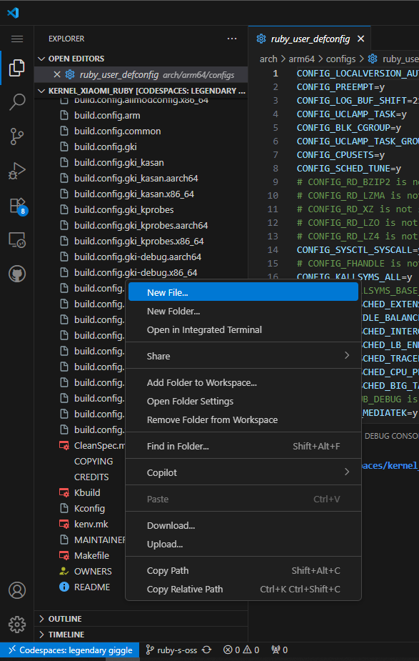

Name it `a.patch` like this:

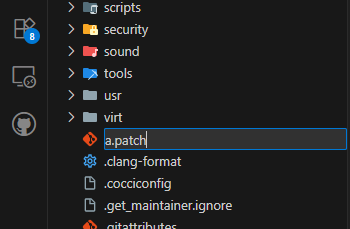

After that, go to <https://gitlab.com/simonpunk/susfs4ksu> to get susfs patches. Click here to change the branches suitable with your kernel version.

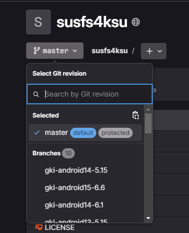

If you don't know what's your kernel version open `Makefile` in your codespace to see it. In this example, the kernel version is `4.19` so I click on `kernel-4.19`

Go to `kernel_patches` folder and click on file patch below. In this example is file `50_add_susfs_in_kernel-4.19.patch`

Copy the content of the file, go back to codespace and paste it in `a.patch` file

Open terminal and run `patch -p1 < a.patch` to let it patch the kernel automatically. If you don't see any .rej file or FAILED log in the terminal, you can skip `step 3.1` which requires you to be careful.

Same action when you apply KSU hook to the kernel, in this tutorial, I use these patches for KSu hook

- <https://github.com/VenturX/kernel_xiaomi_sm6150/commit/8905c5dd09f7ca37029f26bf61bd691decd21381.patch>
- <https://github.com/VenturX/kernel_xiaomi_sm6150/commit/9439840145355631b891683f9a8ce1c8b13da098.patch>

## 3.1. Fix the patches

Before continue, you need to understand the meaning of rej file. `+` means you need to add it, `-` means you need to detele it. That's all.

Now we need to fix the susfs patches. Go to terminal, hold ctrl and click in the .rej file


You will open the .rej file

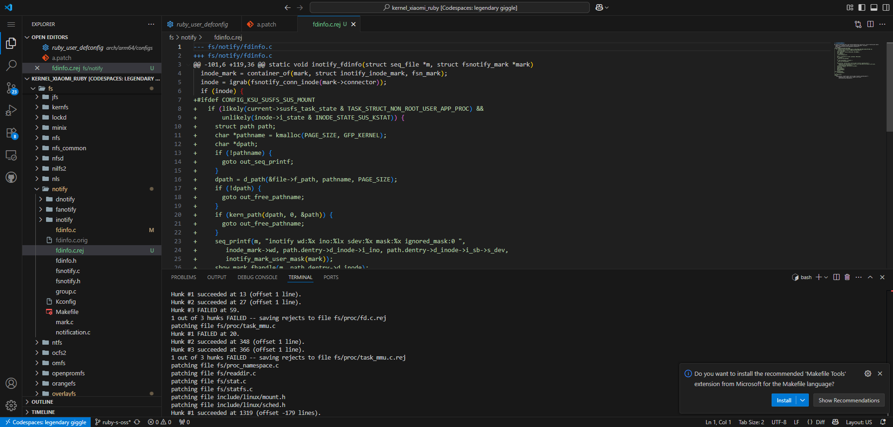

Click on the file that doesn't have .rej, in this example it's `fdinfo.c`


After open the file like this, your job is to find we to apply the patches.

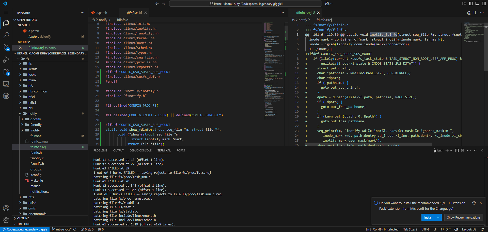

A tip is to see the .rej file, it will have some suggestions about where to apply. Try to find in the file you need to fix with that suggestion like using function name like this

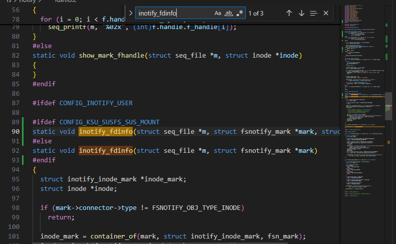

Try to find the similar code in that function, like this one, you will see its similar


After that, apply by remove the similar code when the rej file say that line in `-` at the beginning. And copy the code from rej file to fixing file when the rej file say that line in `+` at the beginning. After that, remove the `-` and `+` at the beginning. You will have a results like this:

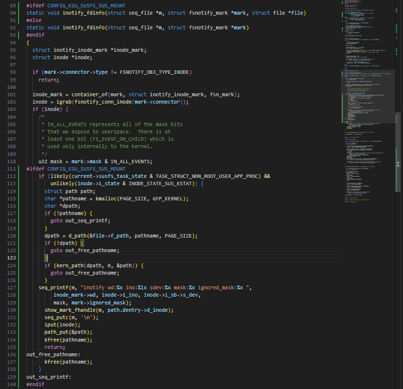

When you finished, delete the rej and orig file and do with the same thing with KSU hook patchesand other files!

## 3.2. Copy susfs files from susfs4ksu source (Only do if you use susfs)

After you finished everything, you copy the file from <https://gitlab.com/simonpunk/susfs4ksu> that you already open in `step 3`

Create, open in susfs4ksu gitlab tab, copy and paste it.

The file should nbe created in the definied directory like this

```txt
fs/susfs.c
fs/sus_su.c
include/linux/susfs_def.h
include/linux/susfs.h
include/linux/sus_su.h
```

## 3.3. Push the changes into your repo

Do this command in the terminal

```sh
git add .
git commit -m "<your_message_commit_can_be_anything>"
git push
```

## 4. Prepare and Build workflow

Fork repo <https://github.com/kernel-build-from-rainyland/builder-non-gki> (Like I said in step 1). Create a file in `.github/configs/production/ksun` (Use add file button)

Type `<device_manufacture>/<device_codename.json>` on name your file field (It will automatically create a folder for this so don't worry)

Use this config template below

```json
{
  "kernelSource": {
    "device": "ruby", // device codename
    "vendor": "xiaomi", // device manufacture
    "name": "moonwake-kernelsu-next", // type whatever you want here
    "defconfig": "ruby_defconfig", // the defconfig name in arch/arm64/configs folder. Choose the one have your device codename
    "extraConfig": "", // leave this empty if you dont have any extra config file like vendor/venus_QGKI.config
    "repo": "https://github.com/kernel-build-from-rainyland/kernel_xiaomi_ruby", // the kernel source link you forked and modified
    "branch": "ksu-type-root-impl" // the branch if the kernel source forked and modified. Open kernel source link again and see the button below kernel source name, you will see the branch you modified
  },
  "kp": {
    "use": false, // If you don't use kernel patch (APatch) leave this alone
    "kpimg_link": "" // If you don't use kernel patch (APatch) leave this alone
  }, 
  "kernelsu": {
    "enable": true, // If you don't use ksu, set to false
    "setupLink": "https://raw.githubusercontent.com/KernelSU-Next/KernelSU-Next/next/kernel/setup.sh", // The setup link of ksu, check the manual in their repo
    "setupArg": "next", // The setup branch of ksu, check the manual in their repo
    "setupName": "KernelSU-Next", // The setup folder name of ksu, it will be the same as repo. Except SukiSU-Ultra will be KernelSU
    "needPatch": true, // If you need to susfs enable patch for using. Some root solution won't need this 
    "susfsLink": "https://raw.githubusercontent.com/wodanesdag/susfs4ksu/refs/heads/next-4.19/kernel_patches/KernelSU/10_enable_susfs_for_ksu.patch" // Patch link
  },
  "toolchains": [
    {
      "url": "https://android.googlesource.com/platform/prebuilts/clang/host/linux-x86/+archive/refs/heads/main/clang-r547379.tar.gz", // Don't touch this if you don't know what are you doing
      "branch": "15.0", // Don't touch this if you don't know what are you doing
      "name": "clang-AOSP", // Don't touch this if you don't know what are you doing
      "binPath": ["./bin"] // Don't touch this if you don't know what are you doing
    }
  ],
  "ccache": true, // Don't touch this if you don't know what are you doing
  "params": {
    "ARCH": "arm64", // Your device arch, it can be arm or arm64. But mostly in arm64 today
    "CC": "clang-AOSP/bin/clang",  // Don't touch this if you don't know what are you doing
    "externalCommand": {
      "KBUILD_BUILD_HOST": "perfc.org", // Your name. Can be whatever you want here. You will see in the kernel info is <yourname>@<yourhost>
      "KBUILD_BUILD_USER": "rainyxeon", // Your host. Can be whatever you want here. You will see in the kernel info is <yourname>@<yourhost>
      "CROSS_COMPILE": "clang-AOSP/bin/aarch64-linux-gnu-", // Don't touch this if you don't know what are you doing
      "CROSS_COMPILE_ARM32": "clang-AOSP/bin/arm-linux-gnueabi-", // Don't touch this if you don't know what are you doing
      "LD": "clang-AOSP/bin/ld.lld", // Don't touch this if you don't know what are you doing
      "LLVM": "1", // Don't touch this if you don't know what are you doing
      "LLVM_IAS": "1", // Don't touch this if you don't know what are you doing
      "AR": "clang-AOSP/bin/llvm-ar", // Don't touch this if you don't know what are you doing
      "NM": "clang-AOSP/bin/llvm-nm", // Don't touch this if you don't know what are you doing
      "OBJCOPY": "clang-AOSP/bin/llvm-objcopy", // Don't touch this if you don't know what are you doing
      "OBJDUMP": "clang-AOSP/bin/llvm-objdump", // Don't touch this if you don't know what are you doing
      "READELF": "clang-AOSP/bin/llvm-readelf", // Don't touch this if you don't know what are you doing
      "OBJSIZE": "clang-AOSP/bin/llvm-size", // Don't touch this if you don't know what are you doing
      "STRIP": "clang-AOSP/bin/llvm-strip", // Don't touch this if you don't know what are you doing
      "LDGOLD": "clang-AOSP/bin/aarch64-linux-gnu-ld.gold", // Don't touch this if you don't know what are you doing
      "LLVM_AR": "clang-AOSP/bin/llvm-ar", // Don't touch this if you don't know what are you doing
      "LLVM_DIS": "clang-AOSP/bin/llvm-dis" // Don't touch this if you don't know what are you doing
    }
  },
  "image": {
    "use": true, // If you don't use boot.img method, disable this
    "imageUrl": "https://github.com/kernel-build-from-rainyland/kernel_xiaomi_ruby/releases/download/cloud/boot.img", // Link if that boot.img
    "imageName": "boot.img" // File name of that boot.img
  },
  "AnyKernel3": {
    "use": false, // If you use Anykernel method, enable this
    "release": true,
    "repo": "https://github.com/kernel-build-from-rainyland/AnyKernel3", // Your anykernel link, just find it somewhere in github. or clone it from https://github.com/kernel-build-from-rainyland/AnyKernel3. delete device.name2=sunny and edit device.name1=mojito to your device codename
    "branch": "ruby" // the branch of that anykernel
  }
}
```

After you finished anything, go to action tab. Click on `Build Kernel` in your left hand.

Click on run workflow. Type `ksun/<device_manufacture>/<device_codename>.json`. And click run workflow.

Wait for your build and done!
